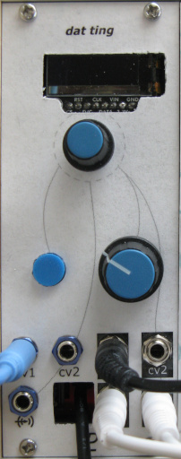

# dat ting

_Multi-function Eurorack module inspired by [dis ting](https://www.expert-sleepers.co.uk/disting.html)_

**dat ting** is a digital multi-function 10 HP Eurorack module using a [Daisy Seed](https://electro-smith.com/products/daisy-seed). Part of my [homebrew Eurorack synthesizer](https://lenp.net/synth/).

[See here](https://lenp.net/synth/dat-ting/) for more info.

