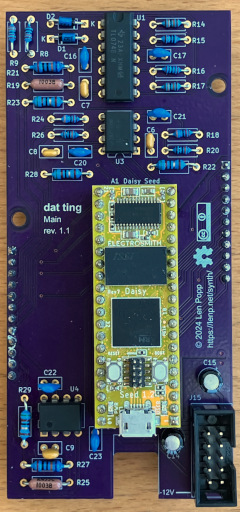
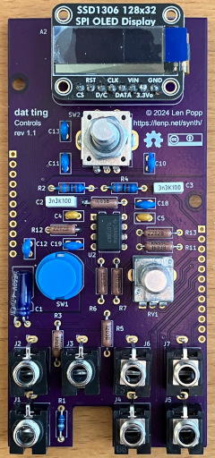

# dat-ting

**dat-ting** is a digital multi-function 10 HP Eurorack module using a [Daisy Seed](https://electro-smith.com/products/daisy-seed).

[See here](https://lenp.net/synth/dat-ting/hardware.html) for more info.

